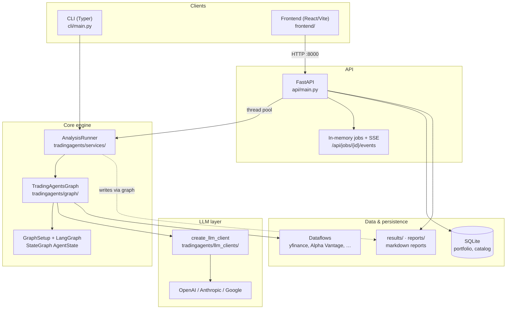
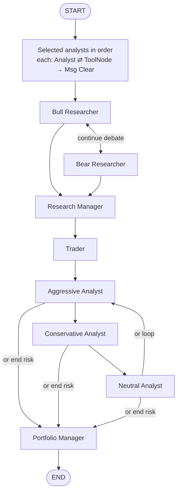
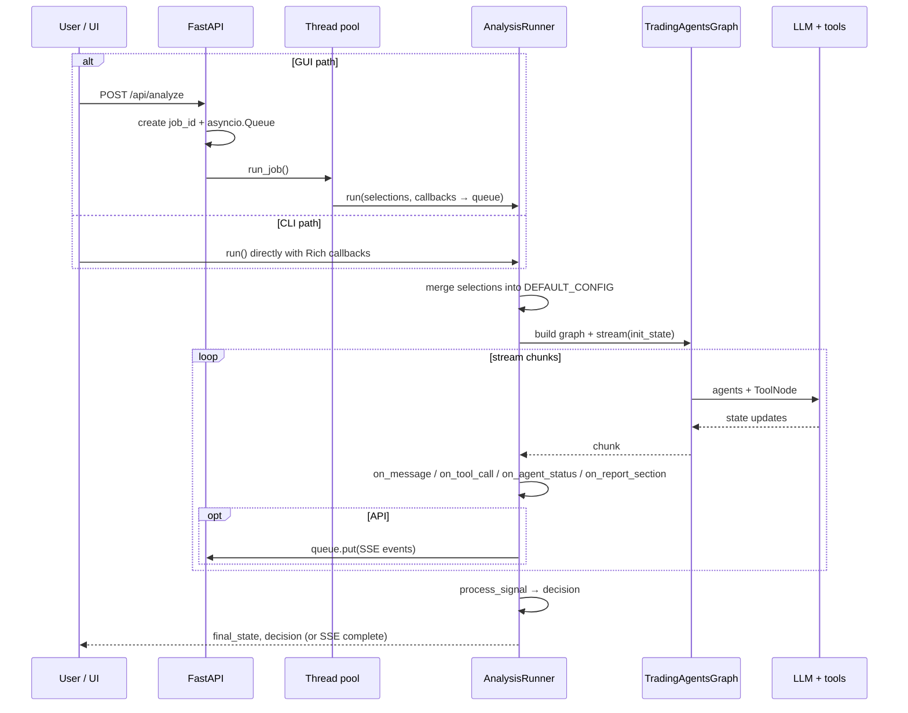

# TradingAgents — project flow

High-level architecture, agent workflow, and how the GUI/API path runs an analysis.

---

## 1. System overview

---

## 2. LangGraph agent pipeline

Analysts run **in user-selected order**, each with **tool loop** (analyst → tools → analyst) then message clear, then the next analyst. After the last analyst, fixed downstream teams run.

**Implementation:** `tradingagents/graph/setup.py` (`setup_graph`), **orchestration class:** `tradingagents/graph/trading_graph.py`.

---

## 3. Analysis run (shared by CLI and API)

**GUI streaming:** `GET /api/jobs/{job_id}/events` returns **Server-Sent Events** until `complete` or `error`.

---

## 4. Frontend routes → API (reference)

| UI page            | Typical API usage                                      |
|-------------------|--------------------------------------------------------|
| Run Analysis      | `POST /api/analyze`, SSE job events                    |
| Reports           | `GET /api/reports`, `GET /api/reports/{id}`            |
| Portfolio         | `GET/POST/PUT/DELETE /api/portfolio/...`, refresh prices |
| Watchlist         | Catalog: `GET /api/catalog/...`, favorites             |
| YouTube summary   | `POST /api/youtube/summarize`                          |

---

## 5. Package map (short)

| Area | Role |
|------|------|
| `cli/` | Interactive Typer CLI, optional stats callbacks |
| `api/` | FastAPI app, SQLite init, job streaming |
| `tradingagents/graph/` | LangGraph wiring, propagation, reflection, signals |
| `tradingagents/agents/` | Analysts, researchers, trader, risk debators, portfolio manager |
| `tradingagents/dataflows/` | Market/news/fundamental data adapters |
| `tradingagents/llm_clients/` | Provider-specific LLM construction |
