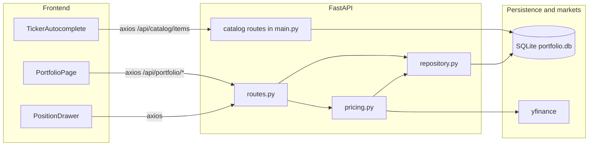

# Positions portfolio — feature flow

This document describes the **positions tracker** in the web app: manual holdings in SQLite, REST APIs, and the React `/portfolio` UI. It is **not** the LangGraph **Portfolio Manager** agent (final synthesis in [tradingagents/agents/managers/portfolio_manager.py](tradingagents/agents/managers/portfolio_manager.py)); that agent consumes analysis state and writes markdown reports, not the `positions` table.

---

## 1. File map

| Area | Path |
|------|------|
| Page + drawer + ticker UI | [frontend/src/portfolio/PortfolioPage.tsx](frontend/src/portfolio/PortfolioPage.tsx) |
| Position editor drawer | [frontend/src/portfolio/PositionDrawer.tsx](frontend/src/portfolio/PositionDrawer.tsx) |
| Catalog-backed ticker field | [frontend/src/portfolio/TickerAutocomplete.tsx](frontend/src/portfolio/TickerAutocomplete.tsx) |
| Barrel export (default page) | [frontend/src/portfolio/index.ts](frontend/src/portfolio/index.ts) |
| Route registration | [frontend/src/App.tsx](frontend/src/App.tsx) (`/portfolio` → default from `./portfolio`) |
| HTTP routes | [api/portfolio/routes.py](api/portfolio/routes.py) |
| Pydantic models | [api/portfolio/schemas.py](api/portfolio/schemas.py) |
| SQLite CRUD (positions + lots + price columns) | [api/portfolio/repository.py](api/portfolio/repository.py) |
| yfinance batch quotes + refresh orchestration | [api/portfolio/pricing.py](api/portfolio/pricing.py) |
| DB path + `init_db()` (schema includes `positions`, `position_lots`) | [api/database.py](api/database.py) |
| App wiring | [api/main.py](api/main.py) — `app.include_router(portfolio_router, prefix="/api")` |

Persistence file: `portfolio.db` at the repo root (path resolved in [api/database.py](api/database.py)).

---

## 2. Data flow

- **List / CRUD positions and lots:** UI calls `GET|POST|PUT|PATCH|DELETE` under `/api/portfolio/...` → `routes.py` → `repository.py` → `positions` / `position_lots` tables.
- **Refresh prices:** `POST /api/portfolio/refresh-prices` → `pricing.run_price_refresh()` loads rows, fetches quotes (and optional FX for TASE + follow ticker), then `update_prices()` writes `current_price` on matching tickers.

---

## 3. REST endpoints

All paths are prefixed with `/api` (router prefix `/portfolio`).

| Method | Path | Purpose |
|--------|------|---------|
| GET | `/portfolio/positions` | List positions with computed `market_value`, unrealized P&amp;L |
| POST | `/portfolio/positions` | Create position (+ meta patch) |
| PUT | `/portfolio/positions/{pos_id}` | Replace ticker, qty, cost, meta |
| PATCH | `/portfolio/positions/{pos_id}` | Update exchange, target weight, notes, follow ticker |
| DELETE | `/portfolio/positions/{pos_id}` | Delete position |
| GET | `/portfolio/positions/{pos_id}/lots` | List lots |
| POST | `/portfolio/positions/{pos_id}/lots` | Add lot (syncs weighted cost on parent) |
| PUT | `/portfolio/positions/{pos_id}/lots/{lot_id}` | Edit lot |
| DELETE | `/portfolio/positions/{pos_id}/lots/{lot_id}` | Delete lot |
| POST | `/portfolio/refresh-prices` | yfinance refresh → `positions.current_price` |

---

## 4. Related project doc

High-level CLI/API/analysis pipeline: [PROJECT_FLOW.md](PROJECT_FLOW.md).
