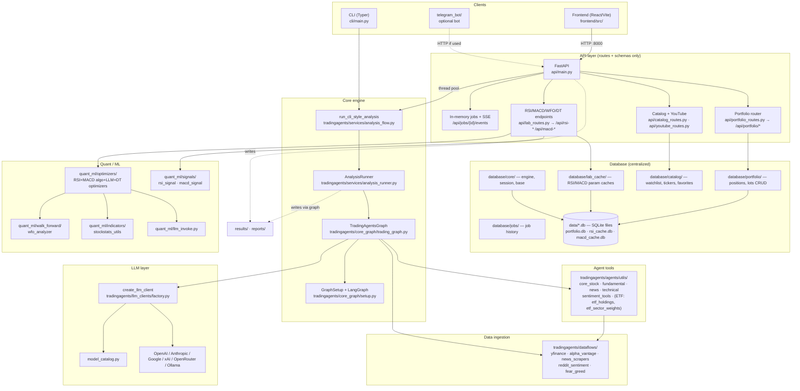
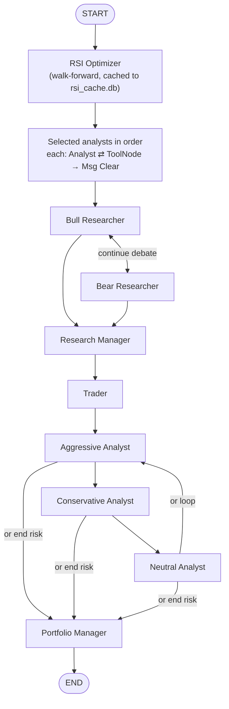
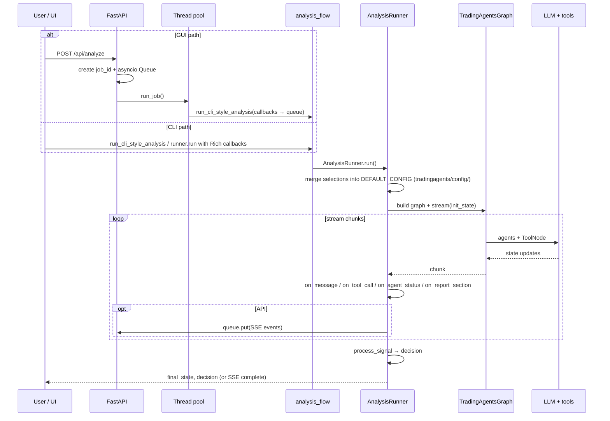

# TradingAgents — project flow

High-level architecture, agent workflow, how the GUI/API runs an analysis, and where the indicator labs live.

---

## 1. System overview



---

## 2. LangGraph agent pipeline

The pipeline begins with the RSI Optimizer, then analysts run **in user-selected order**, each with a **tool loop** (analyst → tools → analyst) then message clear. After the last analyst, fixed downstream teams run.



**Analyst tool sets:**

| Analyst | Tools | Notes |
|---------|-------|-------|
| Market (Technical) | `get_stock_data`, `get_indicators`, `get_rsi_signal` | RSI via cached WFO params — 1 call replaces 9 |
| Sentiment (Social) | `get_reddit_sentiment`, `get_market_fear_greed` | Reddit public API + alternative.me Fear & Greed |
| News | `get_news`, `get_global_news`, `get_insider_transactions` | Ticker-specific + macro news |
| Fundamentals | `get_fundamentals`, `get_balance_sheet`, `get_cashflow`, `get_income_statement`, `get_etf_holdings`, `get_etf_sector_weights` | ETF-aware: instrument context flags ETFs and directs agent to holdings tools |

**Implementation:** `tradingagents/graph/setup.py` (`GraphSetup`), **orchestration class:** `tradingagents/graph/trading_graph.py`.

---

## 3. Analysis run (shared by CLI and API)



**Entry:** `tradingagents/services/analysis_flow.py` wraps `AnalysisRunner` so API and CLI stay aligned.

**GUI streaming:** `GET /api/jobs/{job_id}/events` returns **Server-Sent Events** until `complete` or `error`.

**Optional guard:** `POST /api/analyze` can require `X-TradingAgents-Bot-Secret` when `BOT_API_SECRET` is set.

---

## 4. Frontend routes → API (reference)

| UI page | Route | Typical API usage |
|---------|-------|-------------------|
| Run analysis | `/` | `POST /api/analyze`, SSE `GET /api/jobs/{id}/events`; defaults `GET /api/analysis-defaults`, models `GET /api/llm-catalog` |
| Reports | `/reports` | `GET /api/reports`, `GET /api/reports/{id}`, `GET /api/reports/by-ticker/{ticker}/latest-decision` |
| Portfolio | `/portfolio` | `GET/POST/PUT/PATCH/DELETE /api/portfolio/positions…`, lots under `…/lots`, `POST /api/portfolio/refresh-prices` |
| Watchlist | `/watchlist` | `GET /api/catalog/categories`, `GET /api/catalog/items`, favorites `POST /api/catalog/favorites/{ticker}`, `POST /api/catalog/items` |
| YouTube | `/youtube` | `POST /api/youtube/summarize`, list/detail/retranslate under `/api/youtube/summaries…` |
| RSI Lab | `/rsi-lab` | `POST /api/rsi-optimize`, signals `GET /api/rsi-signal/{ticker}` / `GET /api/rsi-signals`, cache `GET/DELETE /api/rsi-cache…`, DT `POST /api/rsi-dt-optimize`, `POST /api/rsi-dt-portfolio` |
| MACD Lab | `/macd-lab` | `POST /api/macd-optimize`, signals `GET /api/macd-signal/{ticker}` / `GET /api/macd-signals`, cache `GET/DELETE /api/macd-cache…`, `POST /api/macd-wfo-analyze`, DT `POST /api/macd-dt-optimize`, `POST /api/macd-dt-portfolio` |

**Frontend layout:** shared portfolio UI lives under `frontend/src/portfolio/` (`PortfolioPage`, `PositionDrawer`, `TickerAutocomplete`); page shells under `frontend/src/pages/`.

---

## 5. Repository layout (top level)

```
TradingAgents/
├── api/                        # FastAPI web layer — routes & Pydantic schemas only
│   ├── portfolio_routes.py
│   ├── lab_routes.py
│   ├── catalog_routes.py
│   └── youtube_routes.py
├── cli/                        # Typer CLI entrypoint
├── frontend/                   # React/Vite SPA
├── telegram_bot/               # Optional bot entrypoints
├── database/                   # CENTRALIZED DATABASE MODULE
│   ├── core/                   # engine.py, session maker, declarative base
│   ├── portfolio/              # positions, lots CRUD + repository
│   ├── catalog/                # watchlist, tickers, favorites + seed JSON
│   ├── lab_cache/              # RSI/MACD optimization param caches
│   └── jobs/                   # job history (SSE live state stays in-memory)
├── tradingagents/              # CORE APPLICATION LIBRARY
│   ├── agents/
│   │   ├── analysts/           # market_analyst, social_media_analyst, news_analyst, fundamentals_analyst
│   │   ├── risk_mgmt/          # aggressive, neutral, conservative debaters
│   │   └── utils/
│   │       ├── sentiment_tools.py      # get_reddit_sentiment, get_market_fear_greed (@tools)
│   │       ├── fundamental_data_tools.py  # + get_etf_holdings, get_etf_sector_weights
│   │       ├── technical_indicators_tools.py  # get_rsi_signal, get_macd_signal, get_macd_dt_signal
│   │       ├── news_data_tools.py
│   │       └── agent_utils.py          # build_instrument_context (ETF-aware)
│   ├── graph/                  # LangGraph state, node/edge wiring, signal processing
│   ├── dataflows/              # Pure data ingestion (agents only)
│   │   ├── y_finance.py        # + is_etf(), get_etf_holdings(), get_etf_sector_weights()
│   │   ├── reddit_sentiment.py # Reddit public JSON API (no auth)
│   │   ├── fear_greed.py       # CNN Fear & Greed via alternative.me
│   │   ├── alpha_vantage*.py
│   │   ├── yfinance_news.py
│   │   └── interface.py        # route_to_vendor() — single routing point for all vendors
│   ├── quant_ml/               # All ML & heavy math
│   │   ├── optimizers/         # RSI+MACD algo, LLM, DT optimizers
│   │   ├── walk_forward/       # WFO analyzer
│   │   ├── indicators/         # Pure stockstats math
│   │   └── signals/            # rsi_signal, macd_signal, sniper_signal (output layer)
│   ├── llm_clients/            # Provider factories + model_catalog
│   └── services/               # AnalysisRunner, analysis_flow, report_save
├── data/                       # Runtime SQLite files (gitignored)
│   ├── portfolio.db
│   ├── rsi_cache.db
│   └── macd_cache.db
├── tests/
│   └── test_sentiment_tools.py # 11 mock-based tests for Reddit + Fear & Greed dataflows
├── docs/
├── results/                    # Run outputs (gitignored)
├── reports/                    # Markdown reports (gitignored)
├── run_gui.sh
├── pyproject.toml
└── README.md
```

---

## 6. Package map

| Area | Role |
|------|------|
| `api/` | FastAPI routes + Pydantic schemas — **no DB logic** |
| `database/core/` | SQLAlchemy engine, session factory, declarative base |
| `database/portfolio/` | Portfolio tables, positions & lots CRUD |
| `database/catalog/` | Watchlist, ticker catalog, favorites CRUD + seed JSON |
| `database/lab_cache/` | RSI/MACD SQLite param cache read/write |
| `database/jobs/` | Job run history (not live SSE state) |
| `tradingagents/graph/` | LangGraph wiring, propagation, reflection, conditional logic, signal processing |
| `tradingagents/agents/analysts/` | Market (technical), Sentiment (Reddit+FG), News, Fundamentals (ETF-aware) analysts |
| `tradingagents/agents/utils/` | Agent-callable tools: stock, fundamental, news, technical, sentiment, ETF |
| `tradingagents/dataflows/` | Pure market/news/fundamentals/sentiment data ingestion — **all access via `interface.py`** |
| `tradingagents/dataflows/reddit_sentiment.py` | Reddit public API — r/wsb, r/stocks, r/options; no auth |
| `tradingagents/dataflows/fear_greed.py` | CNN Fear & Greed via alternative.me; no auth |
| `tradingagents/dataflows/y_finance.py` | yfinance wrapper + `is_etf()`, ETF holdings/sector tools |
| `tradingagents/quant_ml/` | RSI/MACD algo+LLM optimizers, WFO, decision-tree, signals, stockstats |
| `tradingagents/llm_clients/` | Provider-specific LLM factories + model catalog |
| `tradingagents/services/` | `analysis_flow`, `analysis_runner`, `report_save` |
